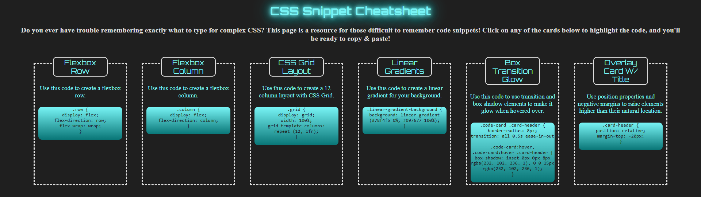

# css_cheatsheet_project

## Description
This project was designed to have us build a responsive 
website with a grid layout and exciting animations, 
that showcases more complicated CSS code that you can 
copy directly to your clipboard and use these specific 
design features in your own code!
This website is a useful resource to update and look back 
on as you continue to learn and grow your more advanced 
coding skills. 

## Screenshot

## Installation Instructions
- Use Git Bash to clone this project repository onto your local machine.
- Once cloned onto your personal machine, navigate into the project directory.
- Launch the project through your GitBash terminal using the "code ." command.
- If you have any issues cloning the repository, refer to this GitHub doc on how to clone a repository. [Cloning-a-Repository](https://docs.github.com/en/repositories/creating-and-managing-repositories/cloning-a-repository).

## Live Demo

## Technologies Used
- Flexboxes
- Glow Animation
- Google Font
- HTML5
- CSS3
- Github Pages

## Color Palette
-   tron-blue: #78f4f5;
-   tron-blue-darker: #097677;
-   dark: #1f1f1f;
-   text: #dcdcdc;

## Google Font
Orbitron: https://fonts.google.com/specimen/Orbitron

## License
MIT License

Copyright (c) 2025 ashnwill01

Permission is hereby granted, free of charge, to any person obtaining a copy
of this software and associated documentation files (the "Software"), to deal
in the Software without restriction, including without limitation the rights
to use, copy, modify, merge, publish, distribute, sublicense, and/or sell
copies of the Software, and to permit persons to whom the Software is
furnished to do so, subject to the following conditions:

The above copyright notice and this permission notice shall be included in all
copies or substantial portions of the Software.

THE SOFTWARE IS PROVIDED "AS IS", WITHOUT WARRANTY OF ANY KIND, EXPRESS OR
IMPLIED, INCLUDING BUT NOT LIMITED TO THE WARRANTIES OF MERCHANTABILITY,
FITNESS FOR A PARTICULAR PURPOSE AND NONINFRINGEMENT. IN NO EVENT SHALL THE
AUTHORS OR COPYRIGHT HOLDERS BE LIABLE FOR ANY CLAIM, DAMAGES OR OTHER
LIABILITY, WHETHER IN AN ACTION OF CONTRACT, TORT OR OTHERWISE, ARISING FROM,
OUT OF OR IN CONNECTION WITH THE SOFTWARE OR THE USE OR OTHER DEALINGS IN THE
SOFTWARE.
